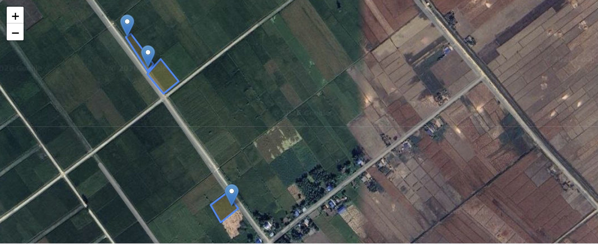
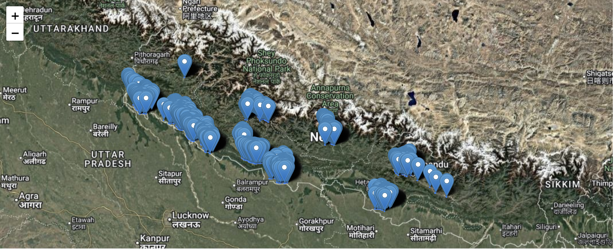
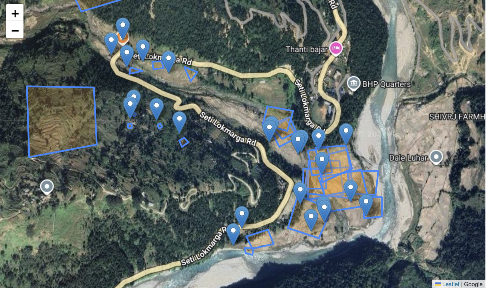
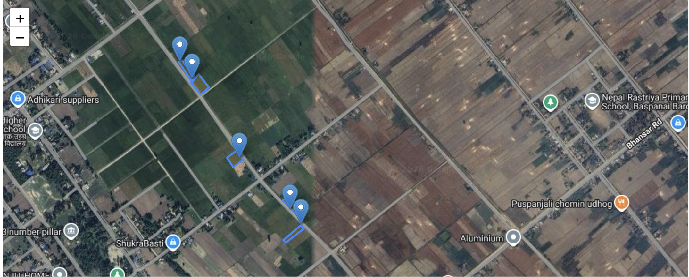

# Ground Truth Validation

A data collection and monitoring system for crop mapping surveys using Kobo Toolbox. This project enables field data collection for ground truth validation of agricultural land use and crop types across multiple regions in Nepal and Mexico.

## Features

- **Real-time data retrieval** from Kobo Toolbox API
- **Interactive map visualizations** of survey points and field polygons
- **Regional analysis** of crop samples by enumerators and geographic areas
- **Multi-region monitoring** for Nepal and Mexico projects
- **Secure credential management** using environment variables

## Deliverables

- **Nepal monitoring notebook** - Ground truth data collection and visual assessment for Nepal crop surveys
- **Mexico monitoring notebook** - Ground truth data collection and visual assessment for Mexico crop surveys

## Overview

Field teams collected GPS point locations and field boundary polygons for crop mapping surveys in Nepal and Mexico. The data collection notebooks provide real-time visualization and visual assessment of incoming survey data, enabling rapid quality feedback to field enumerators as data was collected.

**Data Collected:**
- Nepal: 3,031 data points
- Mexico: 644 data points

### Data Types Collected

*Field boundary mapping from Nepal crop surveys*

#### Point Data
GPS coordinates for sampled field locations collected only when phone GPS accuracy was less than 10 meters. Used for:
- Quick location reference of sampled fields
- Quality assurance of survey coverage
- Mapping of sample distribution across regions
- Ground truthing against satellite imagery

#### Polygon Data
Field boundary geometries digitized by tapping corners of each plot on mobile devices. Used for:
- Precise field boundary mapping
- Calculating plot area
- Analyzing fragmentation and plot sizes by region
- Detailed spatial validation against remote sensing data
- Land use and land cover classification verification

## Validation Criteria

The primary validation approach is real-time visual assessment of data as it is collected in the field, enabling immediate correction and feedback to enumerators:

### Visual Evaluation Indicators
- **Polygon vertices**: At least 4 points expected for field boundaries (3-point polygons flagged as potential quality concerns)
- **Point-in-polygon**: GPS reference point should fall within its associated polygon boundary
- **Area consistency**: Calculated polygon area should align with reported plot size
- **Minimum area**: Polygons less than 10 meters flagged as problematic

### Real-Time Monitoring
Validation focuses on:
- Visual inspection of incoming data to identify issues as surveys progress
- Rapid feedback to field teams to correct problematic submissions on-site
- Assessment of enumerator performance and data quality patterns
- Identifying systematic issues that require retraining or re-survey

## Sample Visualizations

### Nepal Survey Data

*Survey point locations across Nepal study areas*

*Real-time quality assessment identified problematic data, enabling immediate cessation of collection from affected areas*

*Field polygon boundaries from Nepal surveys*

*Additional field mapping from Nepal collection sites*

### Mexico Survey Data

*Survey point locations across Mexico study areas*

*Field polygon boundaries from Mexico surveys*

## Contributors

- [Krishna Kafle](https://github.com/krishnakafle)
- [Saral Karki](https://github.com/saralkarki)
